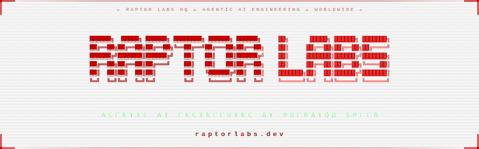

<div align="center">




</div>

---

<div align="center">

```
╔══════════════════════════════════════════════════════════════════════════╗
║   🦖  Autonomous agents that build, deploy & scale at predator speed    ║
║              Worldwide operational  ·  Always building                  ║
╚══════════════════════════════════════════════════════════════════════════╝
```

</div>

> **Agentic AI engineering at predator speed.** Autonomous agents ship enterprise-grade software and launch MVPs in days, built to scale to millions.

---

## 💼 Engineering Services

```yaml
Agentic AI Development:
  - Autonomous agent design & deployment
  - Agentic workflow architecture & orchestration
  - AI inference, fine-tuning & MLOps pipelines
  - LLM integration across OpenAI, Anthropic, Google AI

Rapid Product Engineering:
  - MVP development — days, not months
  - Full-stack web application builds
  - API design, REST & GraphQL implementation
  - SaaS product architecture & launch

Enterprise Solutions:
  - Scalable cloud-native architecture
  - CI/CD automation & DevSecOps
  - Blockchain & Web3 integrations
  - Performance optimization & infrastructure review

Open Source & Community:
  - Developer tooling, CLIs & SDKs
  - Hackathon-bred innovations
  - Community-first open source contributions
```

---

## 🌐 Find Us

| Platform | Link |
|----------|------|
| 🌐 **Website** | [raptorlabs.dev](https://raptorlabs.dev) |
| 🐙 **GitHub** | [github.com/RaptorLabsHQ](https://github.com/RaptorLabsHQ) |
| 💼 **LinkedIn** | [linkedin.com/company/raptorlabs](https://www.linkedin.com/company/raptorlabs) |
| 🐦 **X / Twitter** | [@RaptorLabsX](https://x.com/RaptorLabsX) |
| 📧 **Email** | [info@raptorlabs.dev](mailto:info@raptorlabs.dev) |

---

<div align="center">

**© 2025 Raptor Labs. All rights reserved.**

*Engineered by agents. Shipped at predator speed. Built to scale.*

</div>
